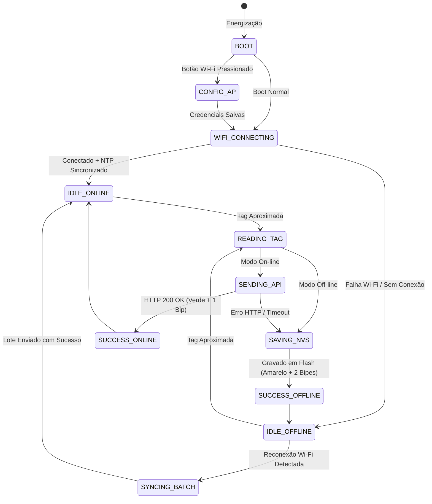

# SCP — Sistema de Chegada de Professores
> **Documentação do Projeto Multidisciplinar**
> **Disciplinas Envolvidas:** Sistemas Embarcados | Web II | Banco de Dados II

---

## Sumário
- [1. Visão Geral do Projeto](#1-visão-geral-do-projeto)
- [2. Fluxo de Funcionamento Detalhado](#2-fluxo-de-funcionamento-detalhado)
- [3. Especificação do Sistema Embarcado (IoT)](#3-especificação-do-sistema-embarcado-iot)
  - [3.1. Guia de Seleção e Recomendação de Hardware (Procurement)](#31-guia-de-seleção-e-recomendação-de-hardware-procurement)
  - [3.2. Mapeamento de Pinos e Conexões (Pinout)](#32-mapeamento-de-pinos-e-conexões-pinout)
  - [3.3. Arquitetura do Firmware & Concorrência (FreeRTOS & FSM)](#33-arquitetura-do-firmware--concorrência-freertos--fsm)
  - [3.4. Gestão de Memória Off-line e Persistência Local](#34-gestão-de-memória-off-line-e-persistência-local)
  - [3.5. Contrato de Comunicação & Payloads JSON (API REST)](#35-contrato-de-comunicação--payloads-json-api-rest)
  - [3.6. Provisionamento Wi-Fi, Sincronização NTP & RTC](#36-provisionamento-wi-fi-sincronização-ntp--rtc)
  - [3.7. Segurança, Autenticação & Atualização OTA](#37-segurança-autenticação--atualização-ota)
  - [3.8. Especificações do Gabinete Físico (Case 3D)](#38-especificações-do-gabinete-físico-case-3d)
  - [3.9. Requisitos Funcionais (RF-EMB)](#39-requisitos-funcionais-rf-emb---sistema-embarcado)
  - [3.10. Requisitos Não-Funcionais (RNF-EMB)](#310-requisitos-não-funcionais-rnf-emb---sistema-embarcado)
  - [3.11. Matriz de Testes do Sistema Embarcado](#311-matriz-de-testes-do-sistema-embarcado)
- [4. Arquitetura de Software e Persistência](#4-arquitetura-de-software-e-persistência)
  - [4.1. Backend](#41-backend)
  - [4.2. Frontend (Dashboard React + TypeScript)](#42-frontend-dashboard-react--typescript)
  - [4.3. Banco de Dados (Persistência Poliglota)](#43-banco-de-dados-persistência-poliglota)
- [5. Próximos Passos](#5-próximos-passos)

---

## 1. Visão Geral do Projeto

O projeto consiste em um **Sistema Inteligente de Registro de Presença e Localização de Professores em Tempo Real**. 

A solução integra hardware (dispositivo IoT/Embarcado) com uma arquitetura web moderna (Backend, Frontend Dashboard e Persistência Poliglota) para automatizar a notificação de presença de docentes nas salas de aula e laboratórios do campus, além de enviar alertas automáticos para turmas/grupos via WhatsApp.

```
+-------------------+       Wi-Fi       +-------------------+       API       +-------------------+
| Leitor Embarcado  | ----------------> |  Backend (Go/Py)  | --------------> |  WhatsApp Notify  |
| (RFID+LED+Buzzer) |                   +---------+---------+                 +-------------------+
+-------------------+                             |
                                                  v
                                        +-------------------+
                                        |  Banco Poliglota  |
                                        |   (SQL + NoSQL)   |
                                        +---------+---------+
                                                  |
                                                  v
                                        +-------------------+
                                        | Dashboard ReactTS |
                                        +-------------------+
```

---

## 2. Fluxo de Funcionamento Detalhado

1. **Aproximação da Tag:** O professor aproxima sua tag de identificação (contendo apenas UID único) do leitor instalado na sala/laboratório.
2. **Leitura e Filtro (Debounce):** O firmware lê o UID da tag e aplica um filtro de tempo para ignorar leituras duplicadas acidentais.
3. **Determinação de Estado (Check-in vs Check-out):**
   - O sistema valida a leitura combinando a **alternância automática** (1º bip = Entrada, 2º bip = Saída) com o **cruzamento da grade horária do docente** no backend (Terça-feira, 19:00, Disciplina Y, Laboratório Z).
4. **Sinalização Visual e Sonora Instantânea:**
   - 🟢 **Verde + 1 Bipe curto:** Transmissão imediata com sucesso ao backend.
   - 🟡 **Amarelo + 2 Bipes curtos:** Salvo off-line com timestamp local (aguardando reconexão Wi-Fi).
   - 🔴 **Vermelho + 1 Bipe longo:** Erro de leitura, tag não cadastrada ou falha do leitor.
   - 🔵 **Azul piscando:** Dispositivo em inicialização ou conectando à rede Wi-Fi.
5. **Envio / Retransmissão de Dados:**
   - **Modo Conectado:** O embarcado envia os dados autenticados para a API do Backend.
   - **Modo Off-line:** O registro com o timestamp sincronizado via **RTC/NTP** é mantido em memória interna e sincronizado assim que a conexão restabelecer.
6. **Validação Inteligente e Disparo do Alerta:**
   - O backend valida a janela de tempo entre o horário da leitura da tag e o término da aula.
   - Se a sincronização off-line ocorrer após o horário limite da aula, o **alerta de WhatsApp é descartado**, mas o **registro histórico de presença permanece gravado** para fins de auditoria acadêmica.

---

## 3. Especificação do Sistema Embarcado (IoT)

### 3.1. Guia de Seleção e Recomendação de Hardware (Procurement)

Para auxiliar o grupo na compra dos componentes físicos, cada item abaixo possui a **Opção Recomendada (A)** (melhor desempenho, estabilidade e recursos) e a **Opção Econômica (B)** (menor custo mantendo a funcionalidade base).

| Componente | Opção Recomendada (A) | Opção Econômica (B) | Preço Estimado (A / B) | Justificativa Técnica & Comparativo |
| :--- | :--- | :--- | :--- | :--- |
| **Microcontrolador** | **ESP32 DevKit v1 (ESP32-WROOM-32)** | **NodeMCU ESP8266 v3** | ~R$ 38,00 / ~R$ 24,00 | **Recomendado (ESP32):** Possui processador Dual-Core (240 MHz), 520KB SRAM, Wi-Fi, Bluetooth e suporte nativo a **FreeRTOS** (multitasking). Permite ler RFID em uma core sem travar requisições HTTP na outra. O ESP8266 é single-core e pode travar durante chamadas de rede. |
| **Leitor RFID/NFC** | **Módulo PN532 NFC/RFID** | **Módulo RFID-RC522 (13.56 MHz)** | ~R$ 45,00 / ~R$ 16,00 | **Recomendado (PN532):** Suporta SPI/I2C/UART e lê tags 13.56 MHz, incluindo **smartphones via NFC**. O RC522 (Econômico) é ótimo, super barato e lê cartões/chaveiros Mifare 1k via SPI, porém não lê celulares facilmente. |
| **Relógio RTC** | **Módulo RTC DS3231 + Bateria CR2032** | **Módulo RTC DS1307** | ~R$ 20,00 / ~R$ 10,00 | **Recomendado (DS3231):** Oscilador com compensação de temperatura (TCXO) de altíssima precisão (deriva de apenas alguns segundos por ano). Garante timestamps exatos em boots off-line sem internet. O DS1307 varia com a temperatura ambiente. |
| **LED RGB (Interface)** | **Módulo WS2812B (Neopixel Endereçável)** | **LED RGB Difuso 4 Pinos (Ânodo Comum)** | ~R$ 8,00 / ~R$ 3,00 | **Recomendado (WS2812B):** Utiliza apenas **1 pino GPIO** para comunicação e permite criar efeitos de iluminação e controle de brilho preciso. O LED de 4 pinos exige 3 GPIOs com PWM e 3 resistores externos. |
| **Buzzer (Sonoro)** | **Buzzer Passivo 5V/3.3V** | **Buzzer Ativo 5V/3.3V** | ~R$ 4,00 / ~R$ 3,00 | **Recomendado (Passivo):** Permite controlar frequências sonoras via PWM (sons agudos de sucesso, grave para erro, melodias de inicialização). O Buzzer ativo só emite um tom fixo estático. |
| **Fonte de Energia** | **Fonte Chaveada 5V 2A USB + Cabo MicroUSB** | **Fonte Genérica 5V 1A USB** | ~R$ 22,00 / ~R$ 12,00 | **Recomendado (5V 2A):** O ESP32 necessita de até 240 mA de pico durante a transmissão Wi-Fi. Uma fonte de 2A previne resets involuntários (*Brownout Reset*) e garante estabilidade total. |

---

### 3.2. Mapeamento de Pinos e Conexões (Pinout)

Tabela oficial de ligação entre os periféricos e o microcontrolador **ESP32 DevKit v1**:

| Periférico | Pino no Componente | Pino no ESP32 (GPIO) | Função / Protocolo |
| :--- | :--- | :--- | :--- |
| **RFID RC522 / PN532** | VCC | 3.3V | Alimentação Lógica (3.3V) |
| | GND | GND | Terra |
| | SDA / SS | **GPIO 5** | SPI Chip Select |
| | SCK | **GPIO 18** | SPI Clock |
| | MOSI | **GPIO 23** | SPI Master Out Slave In |
| | MISO | **GPIO 19** | SPI Master In Slave Out |
| | RST | **GPIO 4** | Reset do Módulo RFID |
| **RTC DS3231** | VCC | 3.3V | Alimentação Lógica |
| | GND | GND | Terra |
| | SDA | **GPIO 21** | I2C Data (Padrão ESP32) |
| | SCL | **GPIO 22** | I2C Clock (Padrão ESP32) |
| **LED RGB WS2812B** | VCC | 5V / VIN | Alimentação do LED |
| | GND | GND | Terra |
| | DIN | **GPIO 13** | Sinal de Dados do Neopixel |
| **Buzzer Passivo** | VCC / Signal | **GPIO 12** | Controle PWM (Som) |
| | GND | GND | Terra |
| **Botão de Reset Wi-Fi**| Terminal A | **GPIO 14** | Botão Físico (Pull-up Interno) |
| | Terminal B | GND | Conecta ao GND ao pressionar |

---

### 3.3. Arquitetura do Firmware & Concorrência (FreeRTOS & FSM)

O firmware será desenvolvido em **C++ (Framework ESP-IDF / Arduino ESP32)** sobre o sistema operacional em tempo real **FreeRTOS**.

#### Mapeamento de Tasks FreeRTOS:
1. `Task_RFID_Scanner` (Core 0, Prioridade Alta): Varredura contínua do leitor RFID (100 ms) com filtro de debounce de 30 segundos.
2. `Task_Network_Manager` (Core 1, Prioridade Média): Gerenciamento da conexão Wi-Fi, envio HTTP REST e sincronização da fila off-line.
3. `Task_UI_Feedback` (Core 1, Prioridade Baixa): Processamento da fila de comandos para o LED RGB e Buzzer sem bloquear a leitura.
4. `Task_Telemetry` (Core 1, Prioridade Baixa): Disparo periódico de Heartbeat (a cada 5 minutos).

#### Diagrama da Máquina de Estados Finos (FSM):



---

### 3.4. Gestão de Memória Off-line e Persistência Local

Em caso de queda da rede Wi-Fi, os eventos de presença são mantidos em memória não-volátil interna (**LittleFS** na Flash do ESP32).

#### Estrutura do Registro Binário (`struct` C++):
```cpp
struct AttendanceRecord {
    char tag_uid[12];      // UID do cartão (ex: "A1B2C3D4") - 12 bytes
    uint64_t timestamp;    // Timestamp UNIX UTC em segundos - 8 bytes
    uint8_t status_flags;  // Bitmask (0x01: Pendente, 0x02: Validado) - 1 byte
    uint16_t crc16;        // Checksum CRC16 de integridade - 2 bytes
}; // Tamanho total por registro: ~23 bytes
```

- **Capacidade Recomendada:** Partição de 1 MB dedicada ao LittleFS armazena com segurança mais de **40.000 leituras off-line**. O requisito mínimo do projeto é armazenar 500 leituras (consumindo apenas ~11.5 KB).
- **Garantia contra Queda de Energia:** Cada registro possui checksum CRC16. Ao religar o dispositivo, registros corrompidos são ignorados automaticamente.
- **Política de Fila Cheia:** Estrutura FIFO (First-In, First-Out). Se a memória atingir 100% da capacidade limite configurada, a leitura mais antiga é descartada para dar lugar à nova leitura, registrando um aviso de alerta na telemetria.

---

### 3.5. Contrato de Comunicação & Payloads JSON (API REST)

A comunicação entre o Embarcado e o Backend ocorrerá via **HTTP REST** (Porta 443 HTTPS com criptografia TLS 1.2).

#### 1. Envio de Presença On-line (`POST /api/v1/attendance`)
```json
{
  "device_id": "EMB-LAB-101",
  "tag_uid": "4A8B12F0",
  "read_timestamp": 1727187600,
  "rssi": -65,
  "is_offline_record": false
}
```

#### 2. Sincronização Off-line em Lote (`POST /api/v1/attendance/sync-batch`)
```json
{
  "device_id": "EMB-LAB-101",
  "batch_count": 2,
  "records": [
    {
      "tag_uid": "4A8B12F0",
      "read_timestamp": 1727180400
    },
    {
      "tag_uid": "9C3D45E6",
      "read_timestamp": 1727184000
    }
  ]
}
```

#### 3. Telemetria e Heartbeat (`POST /api/v1/telemetry/heartbeat`)
```json
{
  "device_id": "EMB-LAB-101",
  "firmware_version": "1.2.0",
  "uptime_seconds": 86400,
  "wifi_rssi": -62,
  "free_heap_bytes": 184520,
  "offline_pending_count": 0
}
```

---

### 3.6. Provisionamento Wi-Fi, Sincronização NTP & RTC

1. **Portal Cativo para Configuração de Wi-Fi (WiFiManager):**
   - Caso o leitor não consiga se conectar a nenhuma rede Wi-Fi conhecida ou o botão de reset (GPIO 14) seja pressionado por 5 segundos, o ESP32 entra no modo **Access Point** criando a rede `Presenca-Device-Setup`.
   - O usuário/técnico conecta o celular nesta rede e uma página web abre automaticamente para selecionar o SSID da faculdade e digitar a senha.
2. **Sincronização de Data/Hora (NTP vs RTC):**
   - Ao conectar à internet, o ESP32 consulta o servidor NTP (`pool.ntp.org`) e atualiza o relógio interno do microcontrolador e o módulo físico **RTC DS3231**.
   - Se o ESP32 reiniciar em local **sem internet**, ele lê a hora exata mantida pela bateria do **RTC DS3231**, garantindo timestamps confiáveis nos registros off-line.

---

### 3.7. Segurança, Autenticação & Atualização OTA

- **Autenticação por Dispositivo:** Cada leitor possui um token secreto único (`X-Device-Token`) gravado na partição protegida NVS do ESP32, enviado nos cabeçalhos das requisições HTTP.
- **Proteção dos Dados:** Criptografia TLS 1.2 (HTTPS) em todo o tráfego de dados. As senhas de Wi-Fi salvas no ESP32 são protegidas pela **Flash Encryption** nativa da linha ESP32.
- **Atualizações Over-The-Air (OTA):** O firmware suporta atualização remota via Wi-Fi (`HTTP OTA Update`). A memória Flash do ESP32 possui duas partições de aplicação (`OTA_0` e `OTA_1`). Caso o novo firmware apresente crash no boot, o ESP32 executa o **Rollback** automático para a versão anterior.

---

### 3.8. Especificações do Gabinete Físico (Case 3D)

- **Material de Fabricação:** Impressão 3D em **PETG ou ABS** (maior resistência térmica e mecânica para ambientes escolares/universitários).
- **Design Ergonomico:**
  - Suporte traseiro para fixação rápida com parafusos ou fita dupla face 3M VHB na entrada das salas/laboratórios.
  - Recuo frontal com adesivo instrucional (*"Aproxime seu Cartão Aqui"*).
  - Janela superior de difusão de luz em acrílico translúcido para o **LED RGB Neopixel**.
  - Aberturas acústicas inferiores para propagação clara do som do **Buzzer**.
  - Conector de entrada MicroUSB/USB-C posicionado na parte inferior para evitar infiltração de poeira.

---

### 3.9. Requisitos Funcionais (RF-EMB) — Sistema Embarcado

| Código | Nome | Descrição |
| :--- | :--- | :--- |
| **RF-EMB-01** | Leitura de Tag | O sistema embarcado deve realizar a leitura do identificador único (UID) da tag por aproximação. |
| **RF-EMB-02** | Filtro Anti-Duplicação (*Debounce*) | O firmware deve ignorar leituras consecutivas da mesma tag dentro de um intervalo parametrizável de tempo (ex: 30 segundos). |
| **RF-EMB-03** | Sinalização Visual via LED RGB | O firmware deve acionar o LED RGB indicando o estado atual da operação (Verde: Sucesso/On-line; Amarelo: Off-line; Vermelho: Erro; Azul: Conectando Wi-Fi). |
| **RF-EMB-04** | Sinalização Sonora via Buzzer | O firmware deve emitir padrões sonoros distintos (1 bipe curto: Sucesso; 2 bipes curtos: Off-line; 1 bipe longo: Erro de leitura/conexão). |
| **RF-EMB-05** | Envio de Eventos de Presença | O sistema deve transmitir para o Backend o `UID` da tag, o `Token/ID` do dispositivo e a `data/hora` da leitura. |
| **RF-EMB-06** | Sincronização NTP & RTC | O sistema embarcado deve sincronizar seu relógio interno via NTP sempre que houver internet e atualizar o módulo RTC DS3231. |
| **RF-EMB-07** | Armazenamento Off-line | Em caso de ausência de rede Wi-Fi, o leitor deve salvar a leitura com timestamp local na memória não-volátil interna (LittleFS). |
| **RF-EMB-08** | Retransmissão pós-Reconexão | Ao restabelecer a conexão Wi-Fi, o leitor deve retransmitir automaticamente os registros salvos em memória para o backend na ordem cronológica. |
| **RF-EMB-09** | Envio de Telemetria (*Heartbeat*) | O leitor deve enviar pings de status a cada N minutos informando que está ativo (*Online, Nível de Sinal Wi-Fi RSSI, Uptime, Heap Livre*). |
| **RF-EMB-10** | Portal Cativo Wi-Fi | O dispositivo deve permitir a configuração fácil de credenciais Wi-Fi via modo Access Point caso a rede caia ou o botão de reset seja pressionado. |

---

### 3.10. Requisitos Não-Funcionais (RNF-EMB) — Sistema Embarcado

| Código | Nome | Descrição |
| :--- | :--- | :--- |
| **RNF-EMB-01** | Tempo de Resposta Local | O feedback visual e sonoro (LED e Buzzer) deve ocorrer em menos de 300 ms após a aproximação da tag. |
| **RNF-EMB-02** | Privacidade de Dados no Hardware | O embarcado não deve armazenar nem trafegar informações pessoais do professor; apenas o UID serial do cartão RFID. |
| **RNF-EMB-03** | Comunicação Criptografada | As requisições enviadas ao backend devem ser criptografadas via HTTPS (TLS 1.2). |
| **RNF-EMB-04** | Capacidade da Memória Off-line | A memória não-volátil deve ser capaz de armazenar no mínimo 500 eventos de leitura em modo desconectado sem perda de dados. |
| **RNF-EMB-05** | Compatibilidade de Rede Wi-Fi | O módulo de rede deve suportar o padrão Wi-Fi 802.11 b/g/n (2.4 GHz). |
| **RNF-EMB-06** | Recuperação pós-Queda de Energia | O sistema deve reiniciar e estar pronto para uso em no máximo 15 segundos após receber energia. |
| **RNF-EMB-07** | Autenticação por Dispositivo | Cada leitor deve possuir um token de autenticação único gravado em firmware para garantir a origem dos dados na API. |

---

### 3.11. Matriz de Testes do Sistema Embarcado

| ID | Cenário de Teste | Procedimento | Resultado Esperado |
| :--- | :--- | :--- | :--- |
| **TST-EMB-01** | Leitura Normal On-line | Aproximar tag cadastrada com Wi-Fi conectado. | LED pisca Verde + 1 bipe curto. Registro gravado no backend. |
| **TST-EMB-02** | Filtro de Debounce | Aproximar a mesma tag 3 vezes em menos de 5 segundos. | Apenas a 1ª leitura é processada. As 2 leituras seguintes são ignoradas. |
| **TST-EMB-03** | Transição para Off-line | Desligar o roteador Wi-Fi e aproximar a tag. | LED pisca Amarelo + 2 bipes curtos. Evento gravado na Flash LittleFS. |
| **TST-EMB-04** | Sincronização pós-Reconexão| Religar o Wi-Fi após acumular 5 leituras off-line. | O leitor reconecta e envia os 5 registros em lote para o backend. |
| **TST-EMB-05** | Boot Off-line sem Internet | Desligar a energia e ligar novamente sem rede Wi-Fi. | O relógio mantém a hora correta usando a bateria do RTC DS3231. |

---

## 4. Arquitetura de Software e Persistência

### 4.1. Backend
* **Linguagens em Avaliação:** `Go` ou `Python`.
* **APIs & Comunicação:** API REST (HTTPS) com suporte a recebimento de Heartbeat, telemetria e sincronização off-line em lote.
* **Integrador WhatsApp:** Envio de alertas dinâmicos para turmas com base na validação de horário de aula.

### 4.2. Frontend (Dashboard React + TypeScript)
* **Painel de Monitoramento:** Visualização em tempo real das salas ativas, presença dos professores e status de saúde dos leitores (Online/Offline/RSSI).

### 4.3. Banco de Dados (Persistência Poliglota)

| Modelo de Banco | Tecnologia Sugerida | Finalidade / Tipo de Dado |
| :--- | :--- | :--- |
| **Relacional (SQL)** | PostgreSQL / MySQL | Professores, Disciplinas, Salas, Bloco, Turmas, Grades de Horários, Dispositivos Cadastrados. |
| **Não-Relacional (NoSQL)** | MongoDB / Redis | Logs de eventos de leitura, histórico de presenças, telemetria/heartbeat dos leitores embarcados, logs de auditoria e fila de notificações off-line. |

---

## 5. Próximos Passos

- [x] Especificar regras de negócio e firmware do Sistema Embarcado.
- [x] Mapear Requisitos Funcionais (RF-EMB) e Não-Funcionais (RNF-EMB) do Sistema Embarcado.
- [x] Definir contrato de dados (Payloads JSON), pinout físico e matriz de componentes do Embarcado.
- [ ] Comprar componentes físicos com base no Guia de Seleção de Hardware.
- [ ] Escolher a linguagem do Backend (`Go` vs `Python`) e desenhar as rotas da API.
- [ ] Projetar a estrutura inicial das tabelas SQL e coleções NoSQL.
